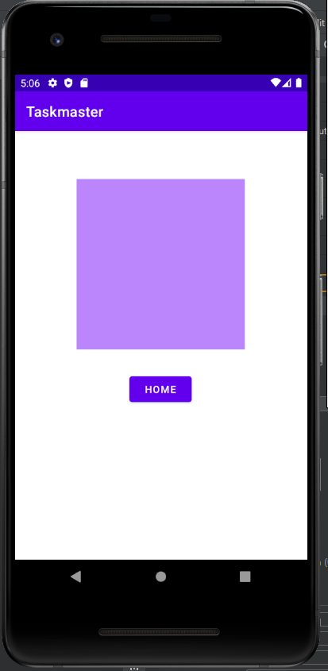
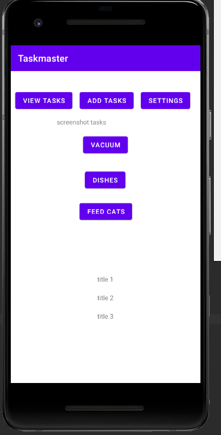

# taskmaster

Home Page with two buttons. One to the "Add Task" page the other to the "View Task" page.

Add Task page with a button to return to the Home Page, a text entry form and a button which populates the text "submitted!"

View Task page with a button to return to the Home Page and a big block of purple to represent an image, which would also represent "viewing" the task.

4/29 hard coded buttons with associated tasks to home page

4/29 pseudo-login page tracking entered text across rest of app

4/29 hard coded event buttons from home page route here with their task name and filler text

5/3 homepage with hardcoded recycler view displaying hardcoded task data

5/3 Task detail page, accessed on-click from tasks on home page

5/3 add task page

5/3 home page, task names from DB populating

5/3 task detail page, accessed on click from tasks on home page, data populated from db

5/4 Espresso tests built
- first checks for UI elements on home page
- second simulates adding a new task, selecting it from the home page and checking that the contents on the details page match what was entered
- third creates a new username and checks that it is displayed properly on the home page 

5/5 database replaced with AWS Ampligy + DynamoDB
- Add task page form adds task to DynamoDB database
- RecyclerView refactored to display tasks from DynamoDB on the home page
- Tasks remain clickable, and route user to details page